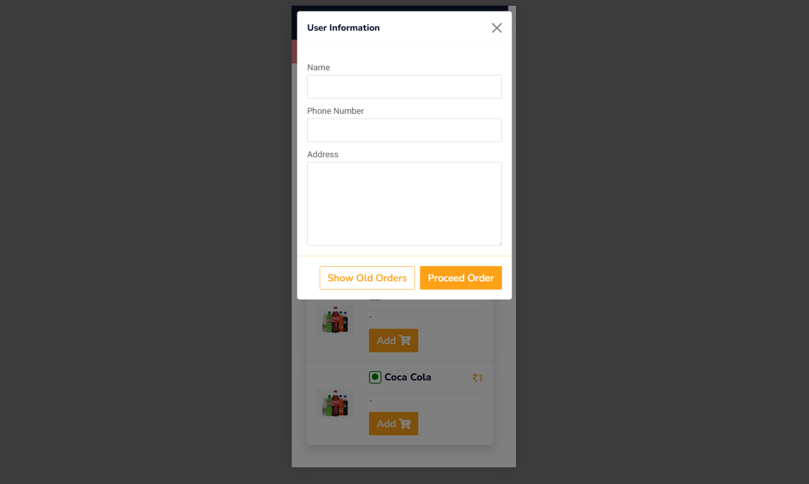
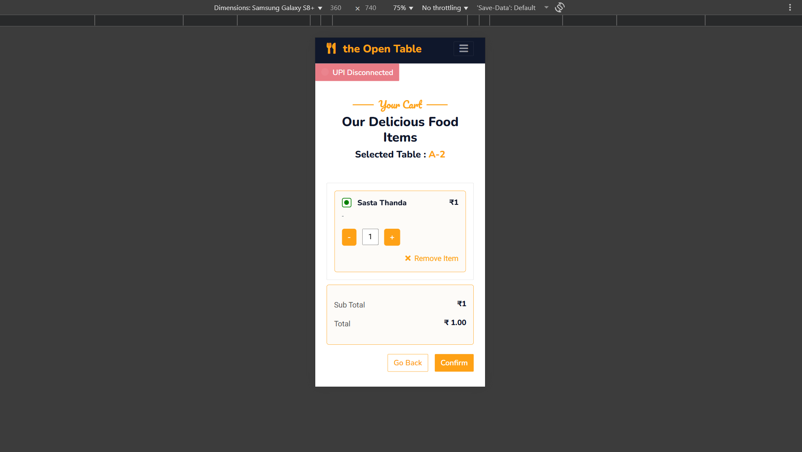
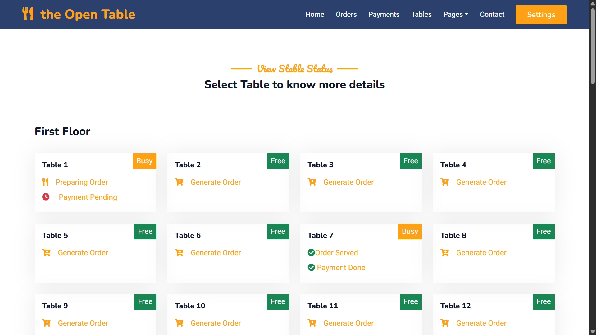

# The Open Table 🍽️  
A **QR-based ordering system** designed for restaurants, enabling customers to place orders for **dine-in** or **delivery** by scanning a QR code.  
The system streamlines food ordering, reduces manual errors, and improves service efficiency.  

---

## 🚀 Features  
- **QR Code Menu** – Customers scan and view the digital menu instantly.  
- **Dine-In & Delivery Support** – Seamless support for both in-house and online orders.  
- **Cart & Checkout** – Add/remove items, calculate totals dynamically.  
- **Order Management Dashboard** – Real-time orders displayed for restaurant staff.  
- **Admin Panel** – Manage menu, pricing, categories, and availability.  
- **Responsive UI** – Works smoothly on mobile and desktop.  
- **Authentication** – Role-based login for customers and admins.  

---

## 🛠️ Tech Stack  
- **Backend:** Django (Python)  
- **Database:** PostgreSQL  
- **Frontend:** HTML, CSS, JavaScript (Bootstrap)  
- **Other Tools:** Django Admin, QR Code Integration  
- **Deployment:** [add your deployment environment, e.g. Heroku/Render/VPS]  

---

## 📸 Screenshots  
| QR Menu | Customer Cart | Admin Dashboard |  
|---------|---------------|-----------------|  
|  |  |  |  

*(Add real screenshots in `/screenshots` folder and update the links above)*  

---

## 🔑 How It Works  
1. Customer scans the **QR code** at a restaurant table or from a delivery link.  
2. The menu is fetched dynamically from the backend.  
3. Customer selects items, adds them to the cart, and checks out.  
4. Orders are sent to the restaurant dashboard in real time.  
5. Admin confirms and forwards the order to the kitchen.  

---

## 👨‍💻 My Role  
- Built and maintained the **backend logic** (Django, PostgreSQL).  
- Designed and implemented the **QR-based ordering flow** with cart and checkout.  
- Integrated **real-time order management** for restaurants.  
- Added **role-based authentication** for customers and admins.  
- Worked on **UI improvements and maintenance** (responsiveness, bug fixes, usability),  
  while the initial **UI design** was created with help from another contributor.  
- Deployed and tested with restaurants in real-world usage.  

---

## 📈 Impact  
- Reduced manual order-taking errors for restaurants.  
- Improved table service efficiency by ~40%.  
- Provided an easy-to-use, scalable solution for restaurants transitioning to digital ordering.  

---

## ⚙️ Installation & Setup  

Clone the repo:  
```bash
git clone https://github.com/guru-sevak-singh/restorent-application.git
cd APP
